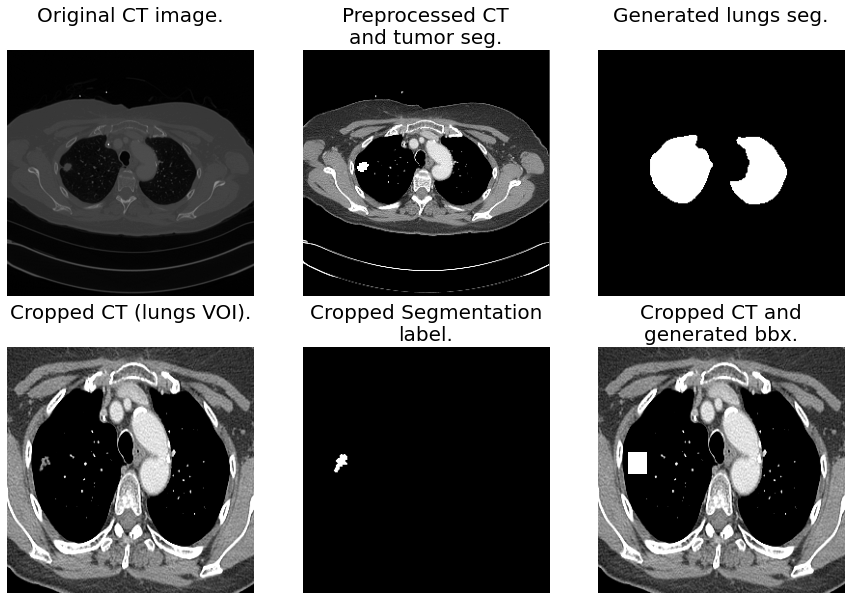
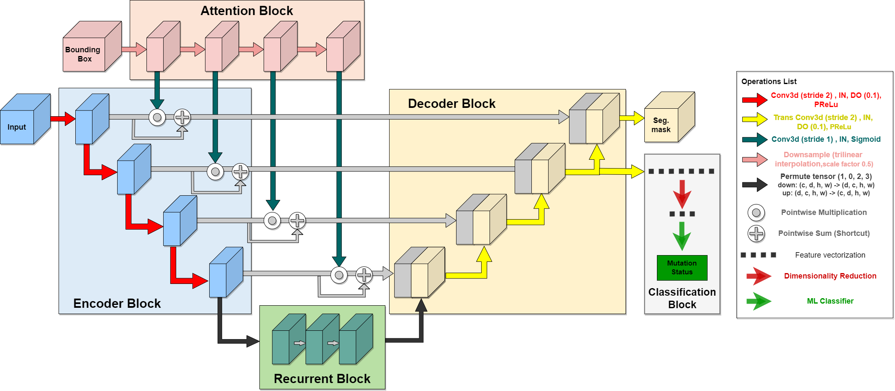
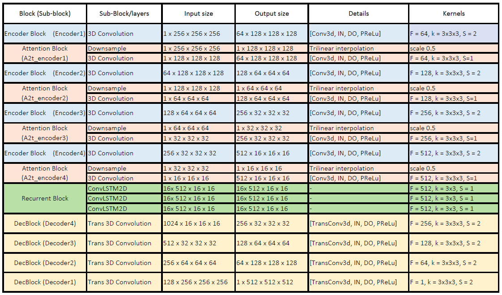
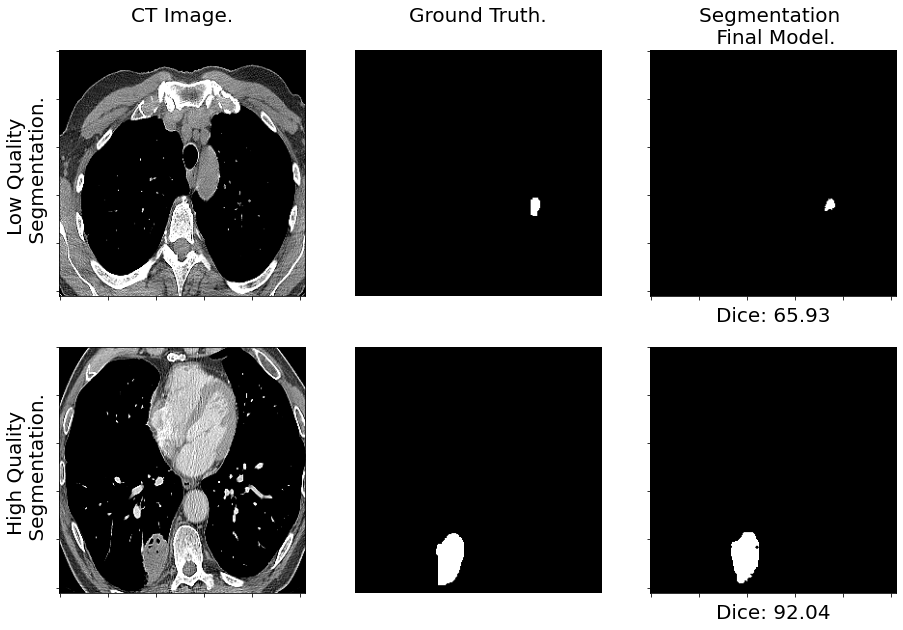

 ## Prediction of EGFR Mutation Status from CT Scans.

## Preprocessing
*Preprocess* argument prepares the data as available from their sources, data is normalized and stored as tensor for training or inference.

For other datasets user must create the corresponding function making sure first axis contains slices, second axis goes from chest to back, and third axis from right to left.


Illustrated example of data preprocessing:



**The architecture of the proposed model**:


**Architecture outline and details:**


## Segmentation Inference. Lung tumor segmentation mask.
Segmentation results:
* Trained on MSD. Average DSC 67.24 (5 fold CV) and 68.65 on RADGEN testset.
* Trained on RAD. Average DSC 72.36 (5 fold CV) and 66.11 on RADGEN testset.
* Trained on MSD+RAD. Average DSC 71.42 (5 fold CV) and 73.54 on RADGEN testset.
* Trained on RADGEN with pretrained weights (MSD+RAD). Average DSC 75.26 (5 fold CV).

Available pretrained weight:
* Trained on RADGEN with pretrained weights (MSD+RAD).




## Classification. EGFR mutation status classification.
Highl-level deep features are extracted from the *Decoder 2* step output. Then undergo preprocessing (mean and flatten operation) with LDA dimensionality reduction.

Classification results:
* Quadratic discriminant analysis (QDA). Average ROC-AUC 0.90 (5 fold CV)
* Decision Tree (DT). Average ROC-AUC 0.91 (5 fold CV)
* Random Forest (RF). Average ROC-AUC 0.93 (5 fold CV)
* C-Support Vector Classification (SVC). Average ROC-AUC 0.83 (5 fold CV)

Classifiers available as SAV files:
* QDA
* DT
* RF
* SVC

Inference command will return the prediction of EGFR mutation status. Class-negative corresponds to "Wildtype" and Class-positive corresponds to "Mutated".
```
cd radiogenomics # Make sure you are on the right directory.

python main.py inf_class DATA_PATH SAVED_MODELS_PATH MODEL
python main.py inf_class ./data/radgen/processed/lungs_roi ./classifiers qda
```
