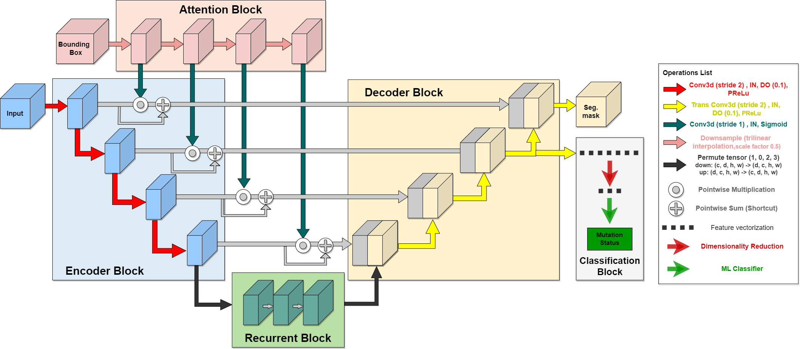
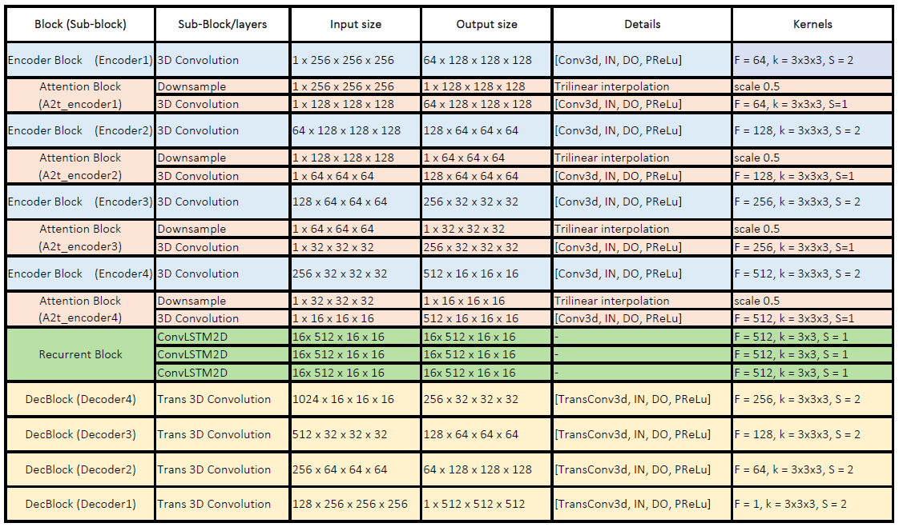
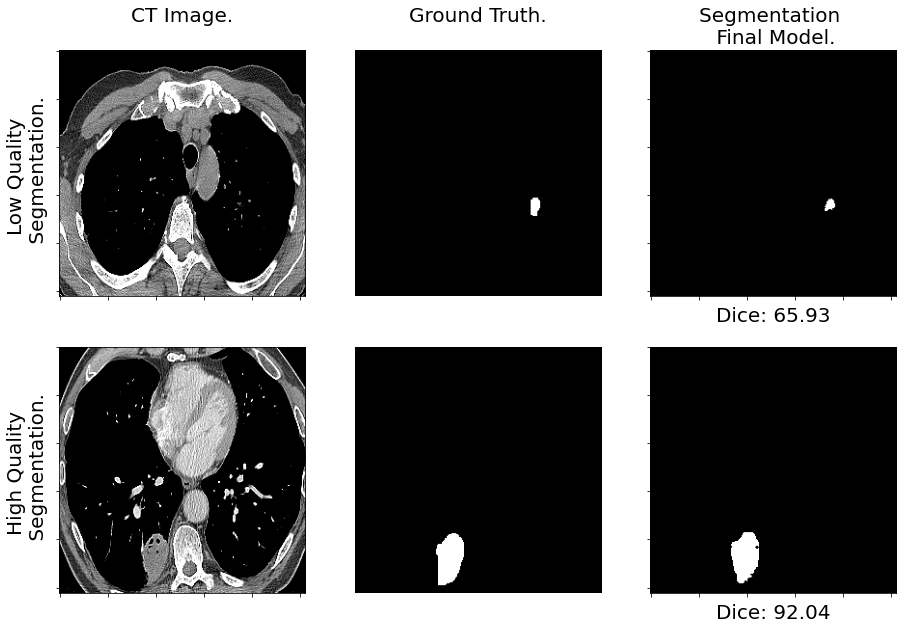
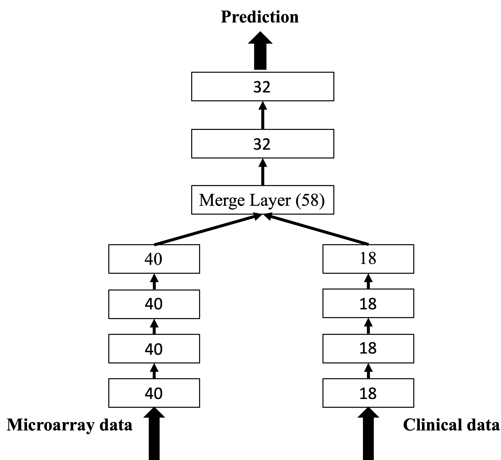

# AIs-Radiogenomic-Symphony-Mapping-Lung-Cancer-through-Gene-image-Correlation
This work aims to construct Deep Learning (DL) and Machine Learning (ML) models for survival analysis, therapy outcome prediction and EGFR mutation status prediction to detect and diagnose lung cancer accurately. 

To aid in the prognosis, diagnosis, and planning of lung cancer treatment. In order to study the links between gene expression profiles and radiomic characteristics that are derived from medical images, a process known as radiogenomics is conducted. The investigation of these connections for both transcriptome and imaging data will be conducted using the suggested methodology. We will extract radiomic characteristics from CT scans and its gene expression profile (RNA-seq). The biological value of these radiomic features was justified by revealing closely associated biological processes and pathways through enrichment analysis on their transcriptomics-based regression models. The most significant differentially expressed genes (DEGs) were selected through Significance Analysis of Microarrays (SAM) and 2-fold change, And multiple models with different purpose will be constructed for different analysis (SVM, Random Forest, k-NN, multi model, DNN, and CNN). The suggested methodological pipeline offers combined radio transcriptomics indicators and models to support the relationship and complementarities between the transcriptome and the phenotypic in cancer, as shown in this research on non-small cell lung cancer (NSCLC) a subtype of lung cancer.

 ## Prediction of EGFR Mutation Status from CT Scans.

## Preprocessing
*Preprocess* argument prepares the data as available from their sources, data is normalized and stored as tensor for training or inference.

For other datasets user must create the corresponding function making sure first axis contains slices, second axis goes from chest to back, and third axis from right to left.


Illustrated example of data preprocessing:


**The architecture of the proposed model**:


**Architecture outline and details:**


## Segmentation Inference. Lung tumor segmentation mask.
Segmentation results:
* Trained on MSD. Average DSC 67.24 (5 fold CV) and 68.65 on RADGEN testset.
* Trained on RAD. Average DSC 72.36 (5 fold CV) and 66.11 on RADGEN testset.
* Trained on MSD+RAD. Average DSC 71.42 (5 fold CV) and 73.54 on RADGEN testset.
* Trained on RADGEN with pretrained weights (MSD+RAD). Average DSC 75.26 (5 fold CV).

Available pretrained weight:
* Trained on RADGEN with pretrained weights (MSD+RAD).




## Classification. EGFR mutation status classification.
Highl-level deep features are extracted from the *Decoder 2* step output. Then undergo preprocessing (mean and flatten operation) with LDA dimensionality reduction.

Classification results:
* Quadratic discriminant analysis (QDA). Average ROC-AUC 0.90 (5 fold CV)
* Decision Tree (DT). Average ROC-AUC 0.91 (5 fold CV)
* Random Forest (RF). Average ROC-AUC 0.93 (5 fold CV)
* C-Support Vector Classification (SVC). Average ROC-AUC 0.83 (5 fold CV)

Classifiers available as SAV files:
* QDA
* DT
* RF
* SVC

Inference command will return the prediction of EGFR mutation status. Class-negative corresponds to "Wildtype" and Class-positive corresponds to "Mutated".
```
cd radiogenomics # Make sure you are on the right directory.

python main.py inf_class DATA_PATH SAVED_MODELS_PATH MODEL
python main.py inf_class ./data/radgen/processed/lungs_roi ./classifiers qda
```


# Overall survival prediction of non-small cell lung cancer by integrating microarray and clinical data with deep learning
This repository provides a reference implementation of *Bimodal DNN* as described in the paper submitted to *Scientific Reports*: *Overall survival prediction of non-small cell lung cancer by integrating microarray and clinical data with deep learning*.

## Prognostic biomarker selection
The built gene interaction networks based on microarray data. Based on our previous research, we selected 7 prognostic biomarkers with high prognsotic relevance values (PRV) and combined with 8 eight well-known biomarkers to form a set of 15 prognostic biomarkers for NSCLC patient overall survival prediction. Their interactions are illustrated with the following figure generated with [STRING](https://string-db.org/):
<div align="center">
  
</div>

## *Bimodal DNN* model architecture
The *Bimodal DNN* consists of two subnetworks for microarray and clincial data, as well as a merge subnetwork. The two subnetworks were first pre-trained with microarray and clinical data, respectively. They were then merged with the merge ubnetwork to obtain the final prediction. The detailed model architecture is illustrated in the following figure and more details can be found in the submitted paper.
<div align="center">
  </img>
</div>

## Basic usage
### Data availability
The combined GSE cohort is available [here](https://drive.google.com/file/d/1dnqQEahODuZpFPiIaZO86ucFRcGuFgAA/view?usp=sharing). The data were first pre-processed and split into train/test splits.

### Examples
You can train the microarray/clinical subnetworks with the following lines. Trained model and its details are saved in */models*.
```python
python3 pretrain_x.py
python3 pretrain_c.py
```
After pre-training, the merged *Bimodal DNN* can be trained with
```python
python3 merge.py
```
### Results
<div>
  <figure>
  
  <figcaption><center>Loss per epoch for the microarray subnetwork.</center></figcaption>
  </figure>
</div>
<div>
  <figure>
  
  <figcaption><center>Loss per epoch for the clinical subnetwork.</center></figcaption>
  </figure>
</div>
<div>
  <figure>
  
  <figcaption><center>Loss per epoch for the merge network.</center></figcaption>
  </figure>
</div>


